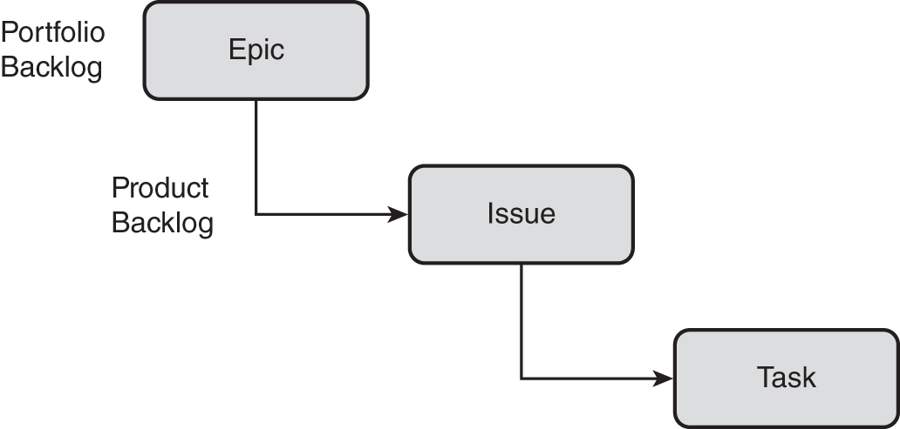

## new azure board document

* the below __basic__ task flow

* 

* the below __agile process__ task flow

* 

* the below __scrum process__ task flow

* 

## CMMI

* __CMMI__: The Capability Maturity Model Integration (CMMI) process is more appropriate when the team follows a more formal project methodology that requires a process improvement framework and a record of supportable decisions. This process model helps track requirements and change requests, risks, and assessments.

* 

* need some other images of , how to create work item

