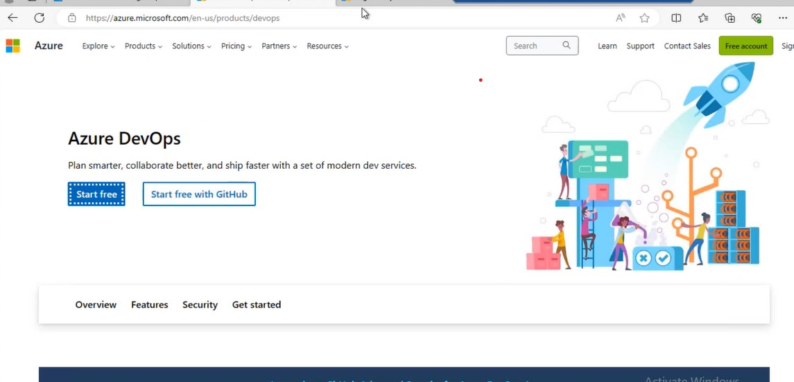
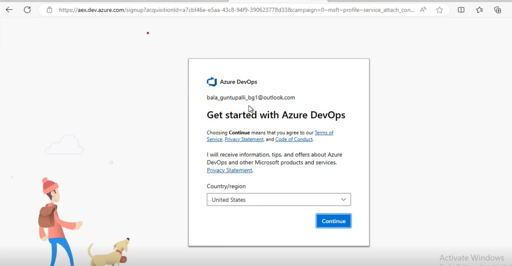
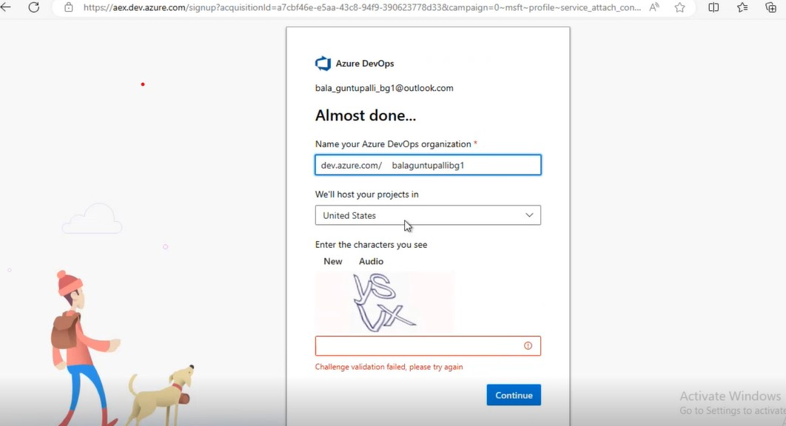
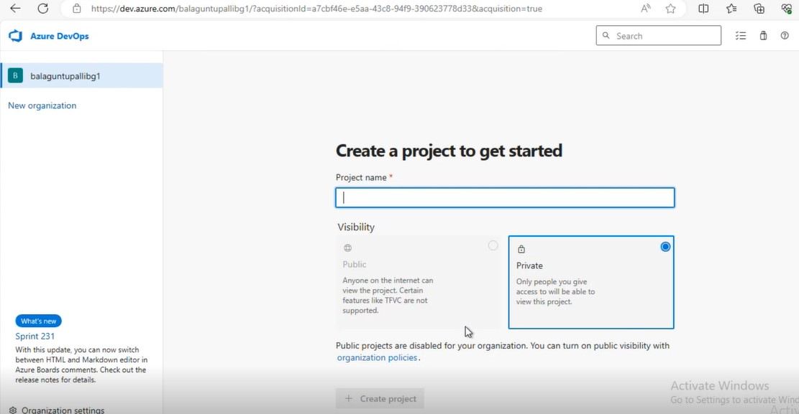
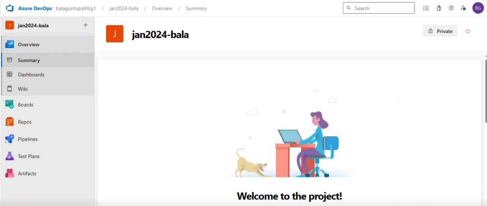

### in this , we are going learn , how to create Azure DevOps account.

* search "azure DevOps in google"
 * start for free

 * we can use personal  __outlook__ and office (company email), __"personal Gmail is not supporting"__ to create AZURE DevOps account.
  * in this demonstratin creating with __outlook.com__

* to this URL https://azure.microsoft.com/en-in/products/devops

* in the above image, if we click on github, it  re-direct __github__ account

* if we  click "signin" , it require personal __outlook__ email__ to create __azure DevOps account__

* in this above image, it ask the below things
  * organisation name
  *  project host place, , give the details , it will go to next page

* in this image, it is asking __project name__  and __Project type__
  * project type:
     * public : any can see(un-authencated user) from internet , project details, of azure repos pipelines  and other details also.
     * private: it require authentication to view, edit of azure DevOps services
    * 99.999 % we will create private projects only.
  * note : we can change __projectname__ and __project type__ at any time. 

* the above page is azure DevOps UI.
* in the left hand menu, we will see, azure repos, azure pipeline, azure artifcat, azure test plans, we will going to learn in further class.

